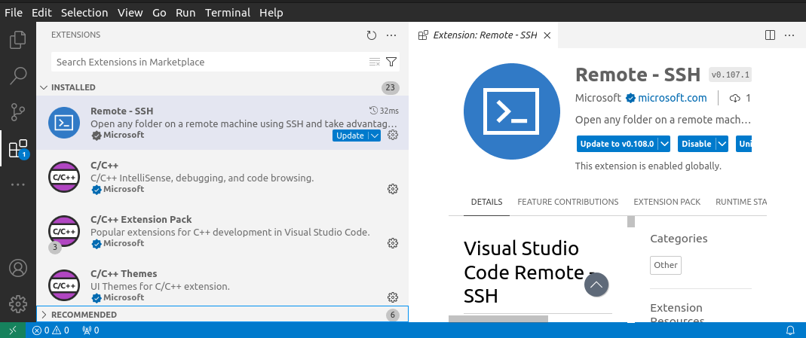
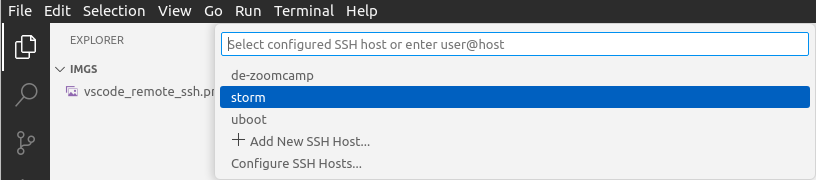
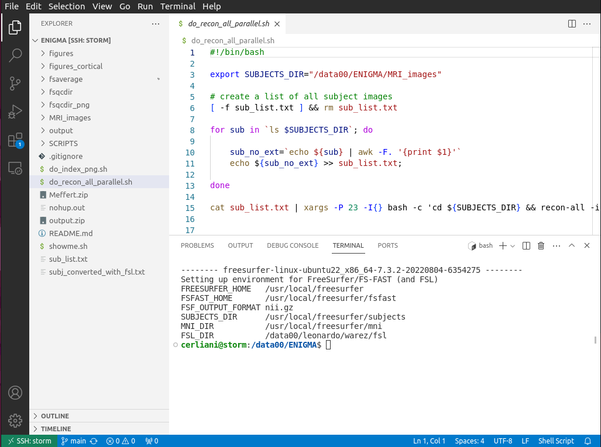
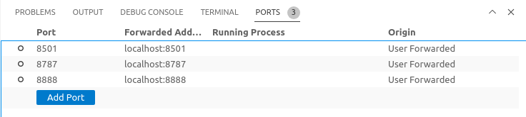

# Remote SSH and port forwarding with VS code

* [SSH from the terminal with username and pw](#ssh-from-the-terminal-with-username-and-pw)
* [SSH with public key](#ssh-with-public-key)
* [Connection and port forwarding using VS code](#connection-and-port-forwarding-using-vs-code)
	+ [Create a local `.ssh/config` file](#create-a-local-sshconfig-file)
	+ [Install the Remote SSH extension](#install-the-remote-ssh-extension)
	+ [Port forwarding from VS code](#port-forwarding-from-vs-code)
* [Conclusion](#conclusion)

## Why should you be interested in reading something with such a complex title
Many services running on servers provide web interfaces on a specific port, e.g. RStudio (8787), jupyter notebooks (8888), pgAdmin (5432), to name a few.

In many cases, it is not possible - or not advisable - to use them on an X interface directly on the server (e.g. with `ssh -X`). Rather it's convenient to forward to the remote server the calls we make to the local port on our local computer, so that we can use the web interface in our local browser.

This can be done using _port forwarding_ in the ssh call. 

VS code provides a simple way to start/stop port forwarding for multiple ports without the need to open one terminal for each of the ports we need.

If you are already familiar with ssh calls using port forwarding, ssh config file, private/public keys, you can skip to [Connection and port forwarding using VS code](#connection-and-port-forwarding-using-vs-code). Otherwise, let's proceed by small steps.


## SSH from the terminal with username and pw
For instance let's say that we have a user `pippo` who can connect via ssh to a server `storm.machine.nl` where an RStudio server is running on port 8787.

In this case we can connect from the terminal using

```bash
ssh -L 8787:localhost:8787 pippo@storm.machine.nl
```

This establishes a connection with the server `storm.machine.nl` so that the calls to the port 8787 on our local computer (e.g. out laptop at home) are forwarded to the port 8787 on the remote server.

At this point we can open RStudio in our local browser entering `localhost:8787` in the address.

The first port in the ssh call above is the _local port_, while the second is the _remote port_, so if we would have used e.g. `7777:localhost:8787` we would have opened RStudio on out home computer by pointing our browser to `localhost:7777`

If you are using many services, it is common to use the same port number for the local and the remote port, to avoid having to remember extra port numbers.

## SSH with public key
If we access this connection very often, it can become annoying to enter every time the password. To avoid this we can instead access using a _public key_.

To create a public key, we should make sure that we have OpenSSH (usually it's already installed) to create a pair of private and public keys on our computer. Usually these are stored in the `~/.ssh` directory (where `~` represents the user's home, such as in `/home/pippo`).

To create this keys pair, we first enter the `~/.ssh` directory (we create it if it does not exist yet) and issue

```bash
ssh-keygen
```

We will be asked a few questions and accept the default value. This will generate two files:

```bash
id_rsa
id_rsa.pub
```

The first one - `id_rsa` - is out _private key_. This should stay on our computer, and _never_ to be shared with anyone.

The second one - `id_rsa.pub` - is the _public key_, that we can share with anybody we want. In our specific case, with the server we want to connect to.

Specifically, we want to copy the content of `id_rsa.pub` inside the file `~/.ssh/authorized_keys` _on the remote server_. In our case, on `storm.machine.nl`. Again if the file does not exist in the first place we can create it. If there are already other public keys in that file, just place this newly created public key in the lines below the existing keys.

Now we can log out of `storm.machine.nl`, and next time we will connect with `ssh pippo@storm.machine.nl` - or with the port forwarding version above - we will have access to the server without having to enter the pw.

Note that not only this method is more efficient, but also more secure, because it does not require to enter the password (that somebody unwanted might be seeing)


## Connection and port forwarding using VS code
Let's say that you are working both in RStudio and in a jupyter notebook. 

And you are developing a Streamlit app which runs on port 8501, and you want to see it in your browser as you develop it.

On top of that you are also editing some remote bash files on the `storm.machine.nl`. How do you manage all this from your home laptop?

In theory you can open a new terminal port forwarding connection for each one of these services, but it can become a bit cumbersome. Is there a simpler way?

Yes. You can use VS code to manage all of this connections and script editing.


### Create a local `.ssh/config` file
First, you want to add one more file to your local ssh directory, specifically `~/.ssh/config`. In this file you will describe your connection to storm with the following lines:

```bash
Host storm
	HostName storm.machine.nl
	User pippo
	IdentityFile ~/.ssh/id_rsa
```
This assumes that you have already copied your _public_ key in the `~/.ssh/authorized_keys` on storm (otherwise go back to the previous section : [SSH with public key](#ssh-with-public-key)).

Note that in the config file we define instead the location of our _private_ key in the `IdentityFile` field.

Of course you can have multiple configurations for all the machines you want to connect to.

### Install the Remote SSH extension
At this point open VS code and install the Remote SSH extension.



You might have to restart VS code (or not). After this, you will see appearing in the bottom-left corner a green area with sort of a connection symbol. If you click on that you will be prompted to connect to a host.

VS code will read the config file we just edited and prompt us the possible connections.



If we choose `storm`, a remote version of VS code will be installed on the server (only at the first connection), and another VS code window will be opened, connected to `storm` - as you can notice in the lower-left green area in the VS code window.

Now we can open a folder, edit files, and open a terminal. All of this _as if_ we were working directly on storm



### Port forwarding from VS code
Now it finally comes the part of port forwarding. In the VS code terminal, we can open the `PORTS` section and add all the ports for which we want to forward a local call to the remote server, e.g. 8787 (RStudio server), 8888 (jupyter notebook), Streamlit app (8501)



All of these services on the remote storm server will now be available in our local browser. Specifically, we will have the following services at the corresponding browser address:

- jupyter notebook at `localhost:8888`
- RStudio at `localhost:8787`
- Streamlit app at `localhost:8501`


## Conclusion
Now you can edit remote files and access to web interfaces running on storm directly from the comfort of your home laptop.

This makes working on storm more efficient, intuitive and neat. It also dramatically speeds up the access to services running in web interfaces.

Also, you can install the Python extension of VS code, create python virtual environments and develop your python scripts inside VS code using those virtual environments.

Last but not least, as already mentioned, the access via public key makes connecting to storm faster and more secure. Indeed, the same method (i.e. public key) is the only one accepted nowadays by github to push locally developed code to your online repos: you just need to add your public key to the list in the _Settings >> SSH and GPG keys_ of your github account. So now you also know how to do that.

all the best,\
leonardo
