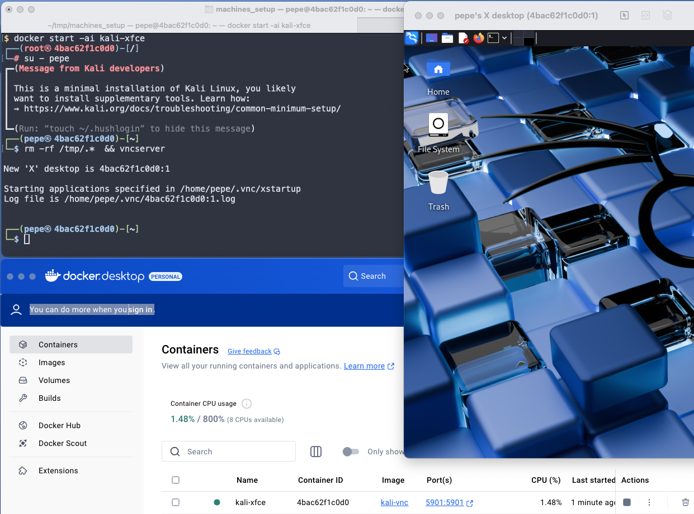

# Reusable docker container with Linux Desktop via VNC

LC Nov 2025


This guide will set up a persistent Kali Linux container with a desktop environment and VNC access.




## Creating the image and the initial container

```bash
# Run the initial image
docker run -it -p 5901:5901 --name kali kalilinux/kali-rolling /bin/bash
```


```bash
# Install basic stuff and vnc server
apt update
apt install sudo passwd adduser nano -y
sudo apt install -y tightvncserver
```


```bash
# Install desktop manager
sudo apt update
sudo apt full-upgrade -y
sudo apt install -y kali-desktop-xfce
```


```bash
# add sudo user
adduser pepe
usermod -aG sudo pepe
su - pepe
```


```bash
# commit the container to a new image
docker commit kali kali-vnc

# start the newly created image in a container
docker run -it -p 5901:5901 --name kali-xfce kali-vnc /bin/bash
```


```bash
# switch to the sudo user and start vncserver
# that will open an X desktop on port 1,
# which matches the mapped port 5901
su - pepe
vncserver
# vncserver :1 -geometry 1920x1080 -depth 24
```


```bash
# connect via mac os finder
CMD-K vnc://localhost:5901
```


## Reusing the container

```bash
# after exiting, reopen the container with
docker start -ai kali-xfce
# also remove the previous .X-lock in tmp
su - pepe
rm -rf /tmp/.*  && vncserver :1 -geometry 1920x1080 -depth 24

# if you need to kill a server
vncserver -kill :1
```


