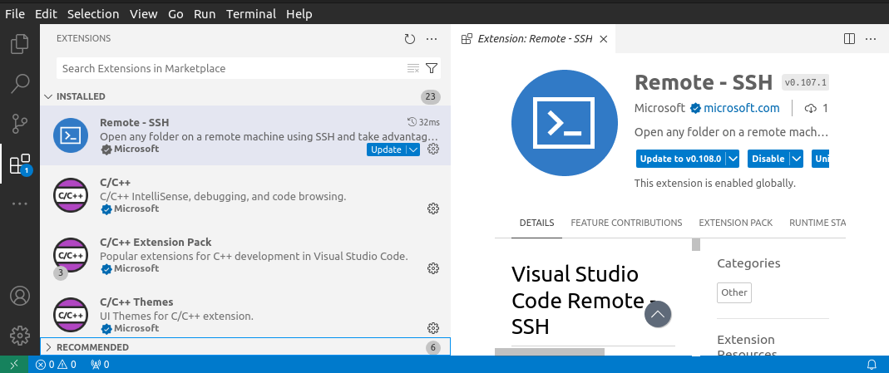
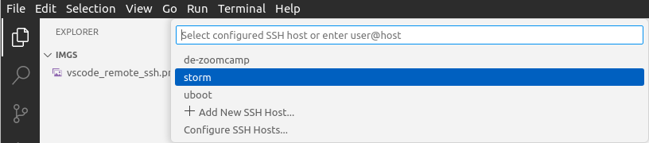
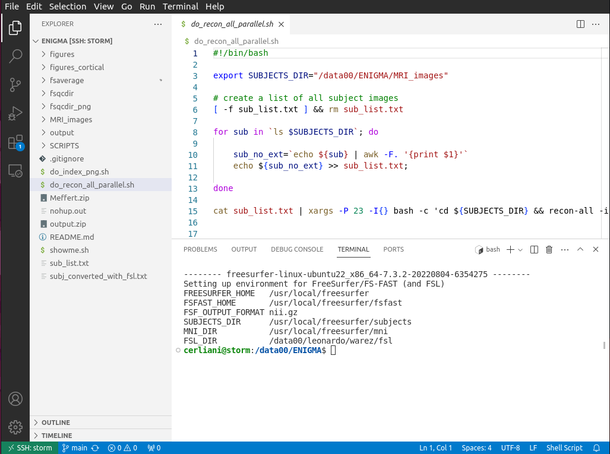
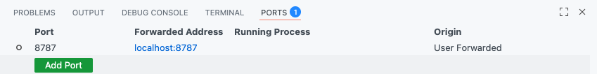
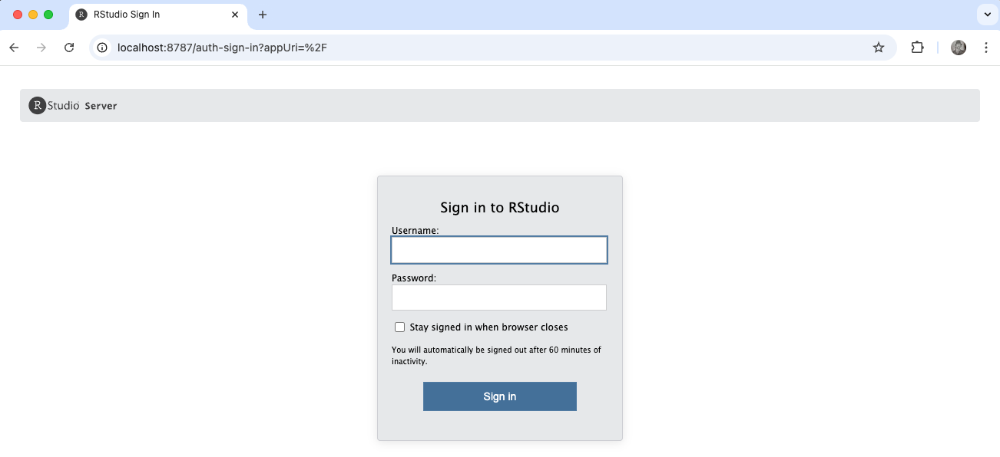
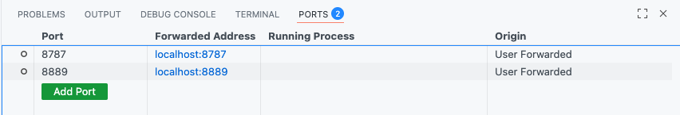
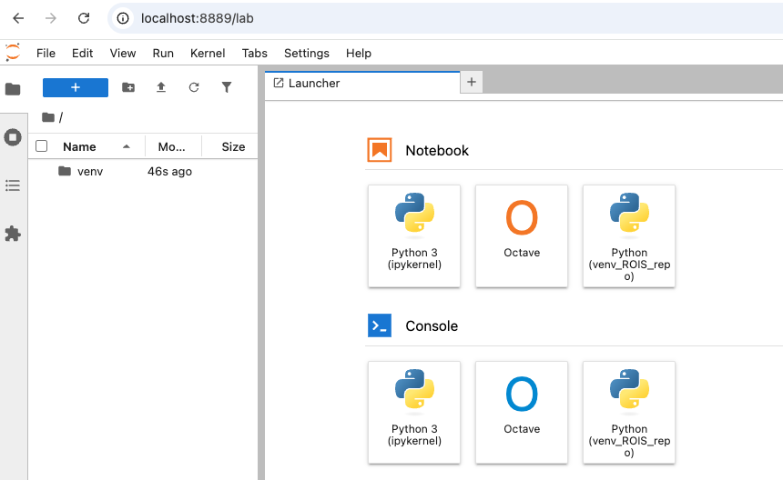
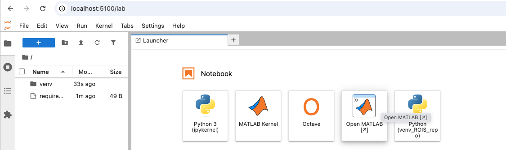

# Running code on storm within your browser using ssh and VS code

LC October 2025


### Table of Contents

- [Motivation](#motivation)
  - [Prerequisites (to verify before the workshop)](#prerequisites-to-complete-before-the-workshop)
- [Creating a set of ssh keys and copying the public key on storm](#creating-a-set-of-ssh-keys-and-copying-the-public-key-on-storm)
  - [Connecting to storm using the terminal](#connecting-to-storm-using-the-terminal)
  - [Creating a `.ssh/config` file for easier access](#creating-a-sshconfig-file-for-easier-access)
  - [Connecting using VS Code](#connecting-using-vs-code)
  - [Copying files between storm and local using VS code](#copying-files-between-storm-and-local-using-vs-code)
- [Using remote services in the browser](#using-remote-services-in-the-browser)
  - [RStudio](#rstudio)
  - [Jupyter notebooks](#jupyter-notebooks)
  - [Google Colab](#google-colab)
  - [Matlab](#matlab)
- [Github bonus](#github-bonus)


# Motivation

We routinely use several coding environments with graphical interface on storm, such as RStudio, Matlab, python Jupyter notebooks. One way to access them is to open a desktop connection using x2goclient and then opening the environment - e.g. Matlab.

However the interface of x2goclient is slow and laggy, because it needs to transfer all the information on the screen many times per second.

Importantly, all of these services also have a web interface, which allows you to run the desired environment directly in a browser on your computer, for a much better user experience.

To do so, we have to set up an [ssh connection](https://www.cloudflare.com/learning/access-management/what-is-ssh/) with storm. Below we will first see how to do so from the terminal, and then how to integrate this in [VS code](https://code.visualstudio.com/), which provides an even better experience than the terminal for opening this connection - especially for different services at once.

In the following I will use the following convention:

- **local machine/browser**: the browser on your laptop
- **remote machine**: storm
- **storm.nl**: a placeholder for the actual address of storm. You should already know this, otherwise ask us.
- **pepe**: is the username I will use below. Replace this with your storm username


## Prerequisites (to complete _before_ the workshop)

- You should have already installed [VS code](https://code.visualstudio.com/) in your local machine
- The commands below are for linux/mac, but they should work well also in windoze. If you are a windoze user and want to contribute with the exact commands, please do so with a pull request.
- On mac/linux, you should be able to open a terminal
  - on mac: Applications --> Utilities --> Terminal
  - on windoze: Main Menu --> `cmd` (opens a PowerShell)
- If you are on windoze, you should make sure that you have access to the command `ssh-keygen` in the PowerShell.
- Make sure you have already a [Twingate client](https://www.twingate.com/download) up and running, allowing you to connect to the nin. (E.g. if you can use x2goclient, you are good to go)
- Keyboard shortcuts: the `CMD` key in Mac should map to the `Ctrl`key in linux and windoze

If you are on windoze, I would warmly encourage you to use the [WSL](https://learn.microsoft.com/en-us/windows/wsl/install) (Windoze Subsystem for Linux) instead of the PowerShell, as it provides a real linux terminal instead of the PowerShell, so that you can follow the instructions below directly. Having said that, it's not strictly necessary to carry out all the steps below.


# Creating a set of ssh keys and copying the public key on storm

Every encrypted message can be read only if the received also got the key to decrypt it. How to securely transfer the key without risking that the key falls in unwanted hands has been historically one of the biggest problems in cryptography (as you can read in [this beautiful book](https://www.amazon.nl/-/en/Simon-Singh/dp/0385495323)). The intuition that led to the algorithms used by SSH is revolutionary in its way of dealing with this problem.

You can think of the process of encrypting a message like applying a lock to a box containing the message. How do you make sure that only the intended receiver gets the key to open the box? The breakthrough idea is *not to send the key at all*. How can this be possible? Let's say you want to send the box to Alice:

1. You send the locked box to Alice

2. Alice applies her own lock and sends it back to you. 
3. When you receive the box, you remove your lock and send it back to Alice , 
4. At this point there is only Alice's lock on the box. She can therefore finally remove *her* own lock and read the message. In other words, the sender was able to deliver the encrypted message to the receiver and to allow her to read the message in the box without any key to be shared between sender and receiver.

In practice, what we do with SSH is to have *a pair of key: a private and a public key*. The sender delivers the public key to the receiver, but the public key is useless without the private key, which always stays with the sender (a simple technical explanation can be found [here](https://www.sectigo.com/resource-library/what-is-an-ssh-key)). This is what we need to do in our case: after generating our own pair of keys, we store the public key on storm, and use it to connect to it without ever sending the private key.

The process you see below is quite complex, but it needs to be done only once.

To get started, open a terminal (linux/mac) or a powershell (in windoze, using `cmd`) and go to your home directory. Then try to go into a folder called `.ssh`

```bash
$ cd .ssh
~/.ssh
$ ls
config          id_rsa          id_rsa.pub
```

If you already see something similar to this, you already have your pair of ssh keys, and you can skip to the part where you copy the public key on storm. Otherwise read further.

If you do not have an `.ssh` folder, just create it with `mkdir .ssh`. Note the period (`.`) in front of the ssh.

```bash
# Open a shell and go to your home dir, e.g. C:\Users\thatsme or /Users/thatsme
# Create the .ssh if it's not there yet
mkdir .ssh
# Change into .ssh
cd .ssh
# Generate the ssh key pair and enter the default values until the keys are created
ssh-keygen -t rsa -b 4096
```

This will create the pair of keys we saw above:

- `id_rsa`: your private ssh key. NEVER share it with anyone.
- `id_rsa.pub`: your public key. You can even put it in your email without any risk. Here's mine:

```
ssh-rsa AAAAB3NzaC1yc2EAAAADAQABAAACAQDHfaHl7U39zp9wfCtDpU5UqTpDMdSr19Dq1SgehZ8+B/8AcdPUlA8qRgamBznLl7FC0wjt95WjWrhejOfntWRAuoRDJ5MoFkNqaoDVudTGL/hOPkS0p4t6NZ6dURsfnPq7hNJFQcS/K7YZjPQvJNfxflicWKIAUJ/PoZSz3+HossuX972dGXjzVtjSphdo0N14cxy5t53rbT3IaaGWaJ8MOU/0uP+KbnIQQZVw3PCu+rEONUDX4CdkucsdfPormX655GnJT2SKbkihkqEKHA4QUalHjkb8YyPzgmmg8+5lo0ko3mJl3VVKUt5dLCn+5gynprfl/uG6pUuGK7b2eP2ZIkfDPfgMCeOxaEJ7VGoemV/hXPXg/giHLKj84U3kHHWgTb9K//ktCztYL+xGwYmGtlj4S462k4cKqmXG4Z50dCiWmgmZmQxvLXPtpJNczPDjsV4tnco6Zme9YkJZWmn5b3NAajWw2sCOTPmSJKQu8D9IiBlUWx+VhbNF8w61IbO7kLx7x17a454NZPoGnojQsGh2TmghWPOxJd/f07MjpjdxDc/duoEmiNsV5MHHI2ORuEU2phPFwv3AVljw8xGSWY3kE3AJtd1PXZZUywSVyV8+rTcDUR4uhJ9Q+kpR7TOo/mz0HEK8Cr+ltKr2oXh2o1ohsf71mCaGi3XJonfErw== pepe@itanos.local
```


At this point you need to connect to storm - e.g. using x2goclient - and go to the corresponding `.ssh` directory in your remote home directory. If it does not exist yet, just create it as you did before.

Then you will open / create the file `.ssh/authorized_keys` and *append* (_not_ 'replace', in case there are already other public keys) the content of the public key `id_rsa.pub` you just created. 

```text
pepe@storm:~/.ssh$ cat authorized_keys 

ssh-rsa AAAAB3NzaC1yc2EAAAADAQABAAACAQDHfaHl7U39zp9wfCtDpU5UqTpDMdSr19Dq1SgehZ8+B/8AcdPUlA8qRgamBznLl7FC0wjt95WjWrhejOfntWRAuoRDJ5MoFkNqaoDVudTGL/hOPkS0p4t6NZ6dURsfnPq7hNJFQcS/K7YZjPQvJNfxflicWKIAUJ/PoZSz3+HossuX972dGXjzVtjSphdo0N14cxy5t53rbT3IaaGWaJ8MOU/0uP+KbnIQQZVw3PCu+rEONUDX4CdkucsdfPormX655GnJT2SKbkihkqEKHA4QUalHjkb8YyPzgmmg8+5lo0ko3mJl3VVKUt5dLCn+5gynprfl/uG6pUuGK7b2eP2ZIkfDPfgMCeOxaEJ7VGoemV/hXPXg/giHLKj84U3kHHWgTb9K//ktCztYL+xGwYmGtlj4S462k4cKqmXG4Z50dCiWmgmZmQxvLXPtpJNczPDjsV4tnco6Zme9YkJZWmn5b3NAajWw2sCOTPmSJKQu8D9IiBlUWx+VhbNF8w61IbO7kLx7x17a454NZPoGnojQsGh2TmghWPOxJd/f07MjpjdxDc/duoEmiNsV5MHHI2ORuEU2phPFwv3AVljw8xGSWY3kE3AJtd1PXZZUywSVyV8+rTcDUR4uhJ9Q+kpR7TOo/mz0HEK8Cr+ltKr2oXh2o1ohsf71mCaGi3XJonfErw== pepe@itanos.local
```


## Connecting to storm using the terminal

Now you can connect to storm from the terminal using

`ssh pepe@storm.nl`

The first time you connect you will be prompted to continue with a message like:

```
The authenticity of host 'storm.nl (xxx.xxx.xxx.xxx)' can't be established.
RSA key fingerprint is SHA256:abc123xyz....
Are you sure you want to continue connecting (yes/no/[fingerprint])?
```

and then you will be on storm

```
$ ssh pepe@storm.nl

Welcome to Ubuntu 22.04.5 LTS (GNU/Linux 5.15.0-151-generic x86_64)

 * Documentation:  https://help.ubuntu.com
 * Management:     https://landscape.canonical.com
 * Support:        https://ubuntu.com/pro

 System information as of Mon Oct 20 09:56:13 PM CEST 2025

  System load:  20.69             Temperature:           64.0 C
  Usage of /:   70.9% of 1.83TB   Processes:             1953
  Memory usage: 26%               Users logged in:       1
  Swap usage:   8%                IPv4 address for eno0: 10.43.0.12

  => /data00 is using 85.1% of 6.86TB

pepe@storm:~$ 
```

Note that *you were not requested to input username and pw*, making therefore your connection also much more secure (NB: you can also set this working in x2goclient).


## Creating a `.ssh/config` file for easier access

Instead of having to type all the time the whole command (the actual address of storm is much more complex) you can use a shortcut by creating a `config` file in `.ssh`. Here's an example, and it should be pretty self-explanatory

```bash
Host storm
    HostName storm.nl
    User pepe
    IdentityFile ~/.ssh/id_rsa
```

Now you can access to storm simply by typing `ssh storm`

Of course if you have access to other servers, you can add them below with the same syntax, for instance:

```
Host storm
    HostName storm.nl
    User pepe
    IdentityFile ~/.ssh/id_rsa

Host digitalocean
    HostName 149.23.12.105
    User linus
    IdentityFile ~/.ssh/id_rsa_digitalocean
```

NB: This example also shows that you can have _different pairs of ssh keys_ for different servers.


## Connecting using VS Code

Connecting to storm uisng VS Code is what will allow you us to edit files directly on storm while working on your laptop, as well as easily opening ports to run services like RStudio or Matlab in your browser. We will see this below. First, let's just see how setting up VS Code to connect to storm will make this connection even easier.

First of all you should install the MS Remote - SSH extension for VS Code



At this point - since you have already the `.ssh/config` file created in the previous step, you can click on the icon in the green bottom-left corner, and you will be presented the option to connect to storm

 

Note that the first time it might take some 20-30 seconds since VS code needs to install a remote version of itself on storm.

After that you can open whatever folder on storm and start to edit / save whatever kind of text file (e.g. scripts, csv, md files) directly in VS code *as if you were doing it on storm* (actually not 'as if'; this is what you are doing). 




## Copying files between storm and local using VS code

- You can copy files from local to storm simply by dragging them in the desired folder in the left pane of vs code 
- You can download files from storm to local by right click --> Download from the left pane of VS Code


# Using remote services in the browser

## RStudio

Now it comes the most useful part. Let's say that you want to use the RStudio server on storm. This runs on the (default) port 8787. 

One way to do this is to connect via terminal and forward the *local* port 8787 to the *remote* port 8787. This sets up a tunnel so that connections to your local port 8787 are securely forwarded to port 8787 on the remote server.

```bash
ssh -L 8787:localhost:8787 pepe@storm.nl
```

However writing this all the times can be tedious, especially if you want to use at the same time several services, like RStudio, Matlab, or another kind of server (e.g. a [Streamlit](https://streamlit.io/) python app), in which case you will have to open a new terminal for each remote service (i.e. each remote port) you want to use in the browser.

A much easier way is to do the same in VS Code. 

- Open the command palette and use the keyboard shortcut `CMD-Shift-p` in Mac or `Ctrl-Shift-p`  in linux / windoze to open `View: Toggle Terminal`
- In the section of the PORTS open the port 8787

You should see something like the following



Now open a browser (e.g. Chrome) on your local computer and type in the address:

``` 
localhost:8787
```

You will be welcomed by the sign-in screen of RStudio code running on storm. Now you can open, edit, run R scripts and Rmarkdown notebooks on storm using this interface.




NB: If any of you is into [Shiny apps](https://shiny.posit.co/), note that we have a Shiny server on storm (`/data00/SBLshiny`), and can be accessed at the (default) port 3838. 


## Jupyter notebooks

With jupyter notebooks - typically for python - it is just slightly more difficult, but not too much.

First you should make sure to have a python virtual environment (e.g. a conda environment) with at least the `jupyterlab` library installed. Explaining python virtual environments is outside of the scope of this tutorial, but I strongly advise you to have a small chat with your favourite AI chatbot about what python virtual environments are and how to create one. Here's the TL.DR:

```bash
# You can create a python virtual environment with the following:
python -m venv myVenv
source myVenv/bin/activate

# Then install jupyterlab
pip install jupyterlab
```

At this point you can start the remote jupyter server with this terminal command

```bash
jupyter lab
```

A lot of text will appear, but you need to look for something like the following:

```
  To access the server, open this file in a browser:
      file:///home/pepe/.local/share/jupyter/runtime/jpserver-3802897-open.html
  Or copy and paste one of these URLs:
      http://localhost:8889/lab?token=82862c107cfdf89ac68936da156bdc57642e09e923323a9d
```

Take note of the port where the jupyter server is running - in this case 8889 - and open it in VS code



Finally, open the web interface at  the same port in the browser:




## Google Colab

Just a bit more complex, but essentially similar to the solution for jupyter lab. The guide is [here](https://research.google.com/colaboratory/local-runtimes.html).


## Matlab

Thanks to [**Sir Owain Kenway**](https://www.youtube.com/@owainkenway/videos) for this [video](https://www.youtube.com/watch?v=w8xCLxd7H0o) and the associated [github repo](https://github.com/owainkenwayucl/Garbage/tree/master/snippets/Matlab-Jupyter).

My implementation (simpler requirements):

1. Create a python venv (virtual environment) on storm with the following `requirements.txt`

```python
jupyterlab 
jupyter-matlab-proxy
notebook<7.0.0
```
NB: use notebook ver < 7.0.0

2. Mount the venv and launch the jupyter lab server, e.g.

```bash
jupyter lab --no-browser --port=5100
```

3. Connect to stroom with VS code and open the corresponding port.

4. Open the Matlab web-UI from jupyter lab

   

5. Enjoy Matlab-in-the-browser at `localhost:5100` in your local browser (the first time it might take 10-20 seconds and you might need to cp/paste the full address with the token)


# Github bonus

As mentioned, SSH access is much more secure than using username and password, and you need to go through the struggle to set it up only once. It is so secure that Github does *not* allow anymore access using uname/pw, but also through SSH key. And now you can do it with the public key you previously created. If you want an explanation of how to add your public key to github [read here](https://github.com/leonardocerliani/github_collab_basic/blob/main/ssh_keys.md).


